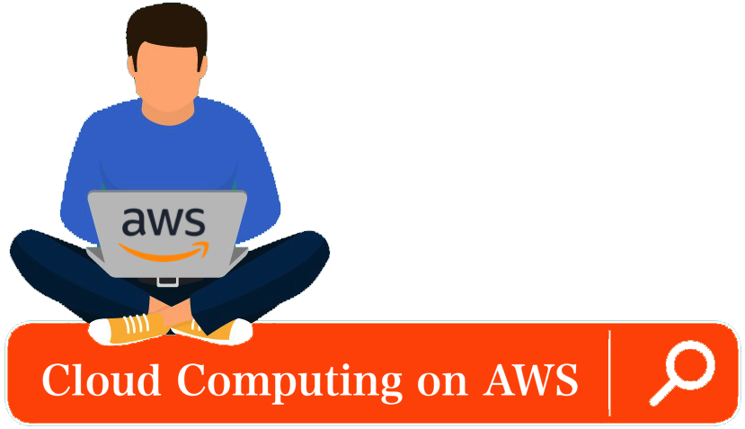

Ambiente no qual será disponibilizado material do Curso de Fundamentos em Computação em Nuvem na AWS.

> Autor: **[Luciano de Aguiar Monteiro](https://github.com/lucianoaguiarthe)**

> E-mail: lucianoaguiarthe@gmail.com
> 
> Site: **[http://www.lucianoaguiar.com.br](http://www.lucianoaguiar.com.br)**

## Apresentação
Slide Curso [Clique Aqui](manuscript/anexos//slide/Cloud_Fundamentals.pdf)

## Manuais
1. [Cadastro AWS Educate](manuscript/awseducate-registration.md)
2. [Acessando uma Instância na AWS](manuscript/acesso.md)

## Laboratórios
Construindo um site estático com Amazon S3 [Clique Aqui](manuscript/anexos/laboratorios/site_static_bucket.pdf)

Criando uma Instância Amazon EC2 [Clique Aqui](manuscript/anexos/laboratorios/ec2-instance.pdf)

Criando uma VPC na AWS [Clique Aqui](manuscript/anexos/laboratorios/vpc.pdf)