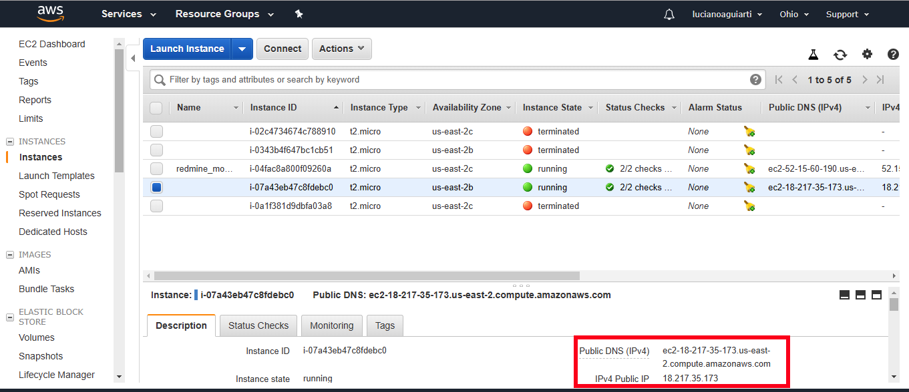

# ACESSANDO UMA INSTÂNCIA NA AWS

O propósito deste material é orientar como o administrador de sistemas deve acessar uma instância na AWS, diante do exposto considera-se que a instância já deva está criado no ambiente e a chave privada gerada e baixada em seu computador. A chave privada é um arquivo que possui uma extensão <b>pem</b>.

## Acessando a Partir de Sistema Operacional Windows

Para acessar acessar remotamente um servidor deve fazer o download de uma aplicação de acesso remoto sugiro o <b>Putty</b>, disponibilizei o link do  instalador para os sistemas operacionais Windows de 32 bits e 64 bits lobo abaixo, neste pacote de instação é também disponibilizado o <b>puttygen</b>, aplicativo necessário para converter a chave primário para o padrão Windows, já que a chave disponibilizada pela a AWS é para ambiente Linux

[PuttyGen](https://the.earth.li/~sgtatham/putty/latest/w64/puttygen.exe)

[Putty 64 bits](https://the.earth.li/~sgtatham/putty/latest/w64/putty.zip)

Ao concluir a instação acesse o menu iniciar o menu Putty e abra o aplicativo Puttygen, confore figura 01, abre a chave privada que você baixou no Amazon apertando no botão load.

A janela a seguir apresentará opções sobre o tipo de chave que um usuário deseja gerar. Selecione a opção ‘RSA’ (Rivest–Shamir–Adleman). RSA é um criptosistema de chave pública comumente usado para transmitir dados com segurança.

Em seguida, clique na opção <b>‘Load’</b>.

(Como o PuTTY é compatível com seu formato de arquivo nativo, ele mostrará apenas arquivos com extensão .ppk. Portanto, os usuários devem escolher a opção 'Todos os arquivos' na barra suspensa. Ele exibirá todos os arquivos principais incluídos no .pem Arquivo.)

<h4 align="middle">Figura 01 - PuttyGen</h4>

Você deverá apontar o caminho onde está localizada a chave privada no seu computador, Figura 2, todavia sua chave não será reconhecida, selecione no canto inferior esquerdo a opção  <b>All Filles (*.*)</b>, e carregue a chave desejada.

Em seguida selecione o botão <b>Save private key</b> será perguntado se você tem certeza que não quer proteger a chave com uma senha, como é um ambiente de teste selecione sim, abribua um nome e local para salvamento, Figura 03.

<h4 align="middle">Figura 03 - Chave Privada</h4>

Acesso o EC2 e verifique o endereçamento de sua instância conforme exemplificação na Figura 4, em que está destacado o retângulo em vermelho com o IP público da instância e o nome atribuído pela AWS. Você necessitará desta informação para seu acesso remoto

<h4 align="middle">Figura 04 - Instância AES</h4>

Abra o Putty e coloque o endereço da instância no campo <b>Host Name</b>, Figura 5, deixe a porta sugerida 22.

<h4 align="middle">Figura 05 - Putty - Host Name</h4>

Em Connection => Data no Campo Auto-login username coloque o usuário de login do sistema operarional da instância: <b>ubuntu</b>, Figura 06.

<h4 align="middle">Figura 06 - Putty - Username Instância</h4>

Você deverá informar ao Putty a chave privada de acesso a intância, lembrando que esta chave é a que você gerou a partir do puttygen, para isso no Putty Figura 07 e vá em Category => ssh => Auth e do lado direito no campo Private key file for authentication selecione o botão <b>Browse</b> e carrege a chave privada.

<h4 align="middle">Figura 07 - Putty - Chave Privada</h4>

Caso vocês a partir deste ponto apertem o botão <b>Open</b>, acessaram a instância, mas todas as vezes terão que carregar a chave primária e configurar o usuário da instância, para evitar este retrabalho, voltem em Category => Session no campo Saved Sessions, atribuam um nome para a sessão, Figura 08, por exemplo <b>aws-nassau</b>  e cliquem no botão <b>Save</b>. Nos próximos acessos ao Putty as configurações da instância estarão salvas não necessitando informações adicionais.

<h4 align="middle">Figura 08 - Putty - Salvar Configurações</h4>

Ao acessar a instância pela primeira vez vocês terão privilégios de usários comuns, para tornarem-se usuários administradores e poderem instar serviços e aplicações digitem <b>sudo su</b>, transformando seu prompt para o usuário <b>root</b> do sistema.

<h4 align="middle">Figura 09 - Acesso Instância</h4>

## Acessando a Partir de Sistema Operacional Linux e MacOS

O acesso a partir de sistema operacional Unix e Linux torna-se mais fácil considerando que possui cliente ssh, e não necessita de conversão de chaves

Para tornar mais simples o acesso e sem necessidade de digitar localização da chave de acesso, nome de usuário e e endereço de máquina, uma sugestão é passar todos estes parâmetros no arquivo cliente do ssh o arquivo.

O arquivo a ser alterado fica no diretório <b>"/etc/ssh/"</b> e chamado <b>ssh_config</b>.

Abra o arquivo com o seu editor de texto preferido, podendo em meu exemplo estou utilizando o vim, conforme comando descrito abaixo:

<i>vim /etc/ssh/ssh_config</i>

Acrescente as linhas descritas a seguir na última do arquivo:

host server-aws
 Port 22
 IdentityFile ~/.ssh/icev.pem
 User ubuntu

Onde <b>host</b> é o nome que será utilizado para chamar o servidor, <b>Port</b> a porta de acesso, <b>IdentityFile</b> a localização da chave privada, <b>User</b> é o usuário do sistema Operacional.

Para acessar o servidor basta digitar: <b>ssh server-aws</b> 

Bons Estudos a Todos

"A mente que se abre para uma nova ideia, jamais voltará para o seu tamanho original"

Albert Einstein

[Início](/README.md)
