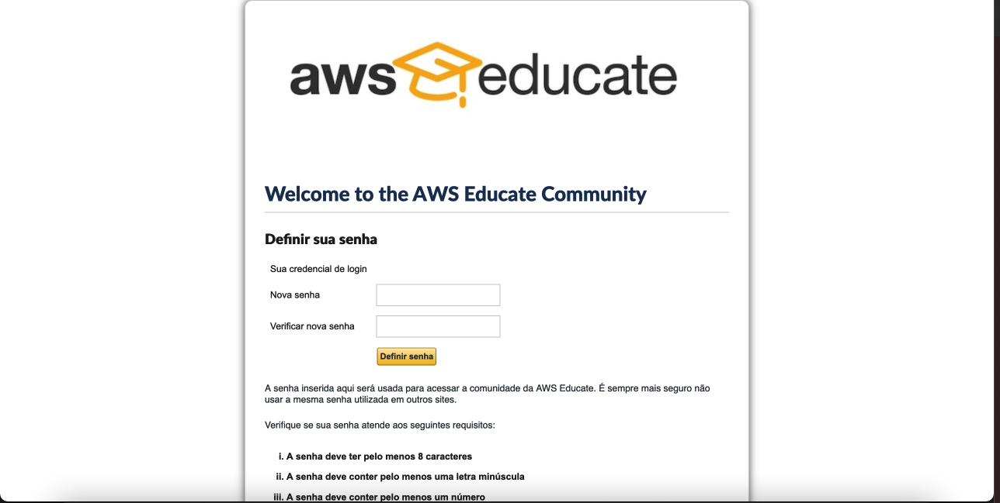
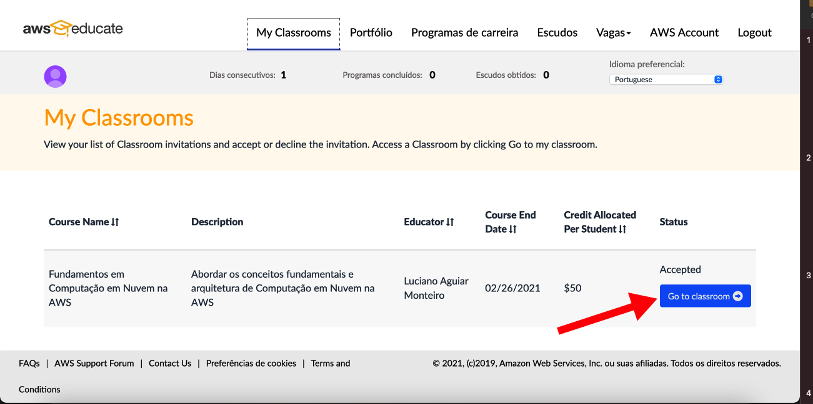
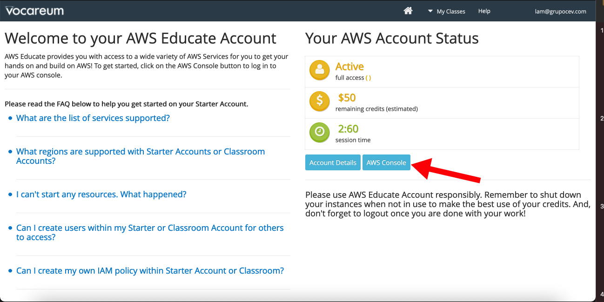

# AWS Educate

O AWS Educate é uma iniciativa global da Amazon que oferece aos estudantes recursos abrangentes para o desenvolvimento de competências relacionadas à nuvem. Trata-se de um currículo gratuito que fornece acesso a conteúdo, treinamento, trajetórias, serviços da AWS e ao AWS Educate Job Board com oportunidades de emprego.

Fonte: (AWS,2021) https://aws.amazon.com/pt/education/awseducate/students/ 

Seu cadastro pode ser realizado pelo estudante, todavia o acesso há uma turma somente é possível a patir de um convite do professor cadastrado. O Foco desta unidade é neste aspecto, apresentar como é realizado o cadastro do aluno a partir do convite realizado pelo professor

O aluno recebe uma notificação em seu e-mail, conforme Figura 01, informe que o mesmo foi convidado para participar do programa e com um link para cadastro.

<h4 align="middle">Figura 01 - Convite Cadastro AWS Educate</h4>

O passo seguinte é o aluno preencher o formulário de cadastro com seus dados, um cuidado especial deve ser dado com o campo da data de conclusão do curso superior, o preenchimento errado com uma data inferior inviabilizaria o cadastro.

<h4 align="middle">Figura 02 - Cadastro AWS Educate</h4>

Ao preencher todos os campos de cadastro será apresentado os termos e condições do programa, Figura 03, no qual o aluno deverá aceitá-lo caso concorde com o mesmo.

<h4 align="middle">Figura 03 - Termos e Condições AWS Educate</h4>

Ao concluir o cadastro o aluno receberá um e-mail de verificação, cuidado especial deve ser dado, visto que o mesmo pode caixar em sua caixa de spam.

<h4 align="middle">Figura 04 - E-mail de Verificação</h4>

A Equipe da AWS irá realizar um análise dos dados cadastro e após um período, no qual não está preestabelecido de quanto tempo, o cadastro será aprovado, geralmente demora no máximo 30 minutos

<h4 align="middle">Figura 05 - E-mail de Aprovação de Cadastro</h4>

Após a aprovação do cadastro, o aluno deve definir uma senha de acesso do AWS Educate, Figura 06, a partir do link recebi no e-mail de aprovação.

<h4 align="middle">Figura 06 - Cadastro de Senha do AWS Educate</h4>

Com a senha definida o aluno poderá realizar seu primeiro acesso no ambiente da <a href=“https://www.awseducate.com/signin/SiteLogin“>AWS Educate</a>, após o login ainda conseguirá acesso a turma no qual foi cadastrada conforme seta inidicada na Figura 07.

<h4 align="middle">Figura 07 - Primeiro acesso ao AWS Educate</h4>

No ambiente da AWS Educate será exibida todas as turmas na qual o aluno faz parte, ao acessar uma delas o usuário será direcionado para outro ambiente administrado por um parceiro da AWS a Vocareum, é ele que irá disponibilizar o acesso aos serviçocs da AWS.

<h4 align="middle">Figura 08 - Acesso a Sala de Aula</h4>

O clicar para acessar a turma escolhida será apresentado a mensagem de confirmação que o aluno está saindo do ambiente da AWS, conforme Figura 09.

<h4 align="middle">Figura 09 - Confirmação de Acesso ao Vocareum</h4>

Ao acessar pela primeira vez o ambiente da Vocareum será apresentado o Termo de Uso, Figura 10, no qual o aluno deverá aceitá-lo para continuar utilizando o ambiente.

<h4 align="middle">Figura 10 - Termo de Uso Ambiente Vocareum</h4>

A Janela inicial do ambiente, Figura 11, apresenta um resumo dos créditos disponilizados para o aluno, assim como o botão de acesso para o console da AWS apresentado na seta vermalha. Ao clicar no botão <b><AWS Console/b> você será direcionado para a console de gerenciamento de serviços da AWS.

<h4 align="middle">Figura 11 - Ambiente Vocareum</h4>

Ao acessar a console de gerenciamento de serviços da AWS, Figura 12, você terá acesso a criação de diversos serviços como instâncias, bucket, IA, entre outros.

<h4 align="middle">Figura 12 - Console de Serviços AWS</h4>

Tenha atenção especial quanto ao uso dos serviços no período de aprendizagem, desligue todos quando não estiver utilizando, como por exemplo uma instância para não consumir os créditos disponibilizados.

[Início](/README.md)